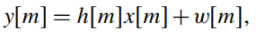
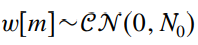
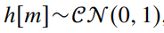
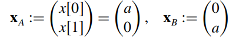
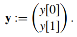
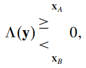
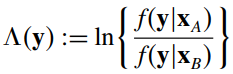
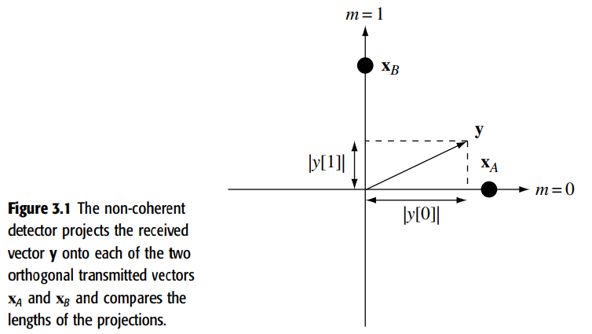

### 3. Point-to-Point comunication: detection, diversity, and channel, uncertainty (2021.06.02)
페이딩 채널에 대한 통신에서 발생하는 다양한 기초 구성에 대해 알아보자
우린 협대역 페이딩 채널에서 비코드화 송신에대해 분석했다

이 단원에서는 Coherent (동기) detection & Non-coherent (비동기) detection (검파)를 공부 할것이다.

동기 : 
이 두가지 경우 페이드가 없는 AWGN (non-faded AWGN) 보다 높은 전송에러 확률을 가진다.
이는 심층 페이드 채널의 상당한 에러 확률의 원인이다. 

그래서 페이딩 현상 완화와 전송의 신뢰성을 향상시키기 위한 다양한 diversity (다중화) 기술을 조사해보자

diversity 기술을 time (시간), frequency (주파수), space (공간)에 대해 생성할 수 있는데 기본적인 아이디어는 모두 같다.

Diversity를 적용하기 위해서는
송신단이 동일한 신호를 다른 path (경로)로 전송할때,

1. 다수의 독립적인 데이터 심볼 복사본 (multiple independently faded replicas of data symbols)을 통해 전송하고
2. 수신받은 페이딩 영향이 적게 신호를 합성하여 

수신단이 더욱 안정적인 검파가 가능해진다.

가장 간단한 기법으로 반복 부호화가 있고 더 복잡한 기법들은 채널 diversity을 활용하는 동시에 채널의 자유도 (degrees of freedom)를 효율적으로 사용한다.

마지막으로 채널 불확실성이 다양성 결합 기법의 성능에 미치는 영향을 알아보자

이번장은 페이딩 채널을 통한 통신을 위한 구체적인 기술에 중점을 두고 주요한 기술, 시스템 성능은 5장에서 볼거다.

#### 3.1 Detection in a Rayleigh fading channel
##### 3.1.1 Non-coherent detection

가장 간단한 검파 문제로 시작해보자
간단하게 채널이 단일 이산 시간 복소 filter tap h0m인 flat fading 모델 (신호대역폭 내에서 페이딩 특성이 변하지 않는 fading 모델)

이때 잡음은 AWGN으로 가정 
채널은 Rayleigh 페이딩을 가정 
서로 다른 시간 m에서 페이딩 계수 사이의 특정한 상관이 존재하지 않고 수신기는 채널에대한 어떠한 사전 지식도 없다.

첫번째로 uncoded binary antipodal signaling (비부호화 2진 대척 신호)
즉, BPSK에서 입력신호 진폭이 a이고 시간에 독립적일때를 고려해보자

This signaling scheme fails completely,(엥?? 완전히 실패된 신호라,,?)

왜냐하면 송신 신호 x = +a or -a에 상관없이 수신된 신호 y의 phase는 0~2pi사이 랜덤으로 분포하기 때문에 완전히 실패한(flawed) 신호이다.
게다가 수신 진폭은 전송 심볼에 대해 독립적이다.
-> 2진 위상 modulation(변조)는 위상 변조가 일반적으로 결함이 있음을 알 수 있다.

그래서 서로 다른 신호가 서로 다른 크기를 갖거나 심볼 간의 코딩이 사용되는 신호 구조가 필요하다.

그렇다면 다음으로 심볼 사이의 특수 코딩 유형인 Orthogonal signaling을 살펴보자
간단한 직교 변조 기법 : binary pulase-position modulation에서

한 쌍의 시간 샘플에 대해 xA 또는 xB 전송할때, 

다음 식을 기반으로 수신 신호를 탐지한다고 할때 

y를 확인했을때 xA라 할지 xB라 할지 결정 해야하는 간단한 hypothesis testing (가설 검정) 문제이며
y가 xA라 결정할 Maximum likelihood (ML) 규칙은 이렇게 도출할 수 있다. (Bayesian decision theory로 결정)

y가 xA가 전송하였다고 결정 --> xA이 전송되었을때 y에 대한 확률 >= xB이 전송되었을때 y에 대한 확률

이를 log-likelihood로 나타내면 *f()는 probability distribution function*

 이렇게 된다.

그렇다면 xA가 전송되었을때 Y의 분포가 밑 그림과 같이 복소가우시안을 따르고, xB가 전송되었을때 Y의 분포가 밑의 그림과 같이 복소가우시안을 따를때
log-likelihood ratio는 다음과 같을 것이다.

수신단은 y[0]^2 > y[1]^2 이면 무조건 log-likelihood는 양수이기 때문에 송신 펄스가 xA이라고 결정할 수 있다. <수신신호의 위상은 사용하지 않는다.>

기하학적으로 수신된 신호 y는 각 시간축에 대해 투영(Projection)한 거리, 에너지를 비교하는 것으로 검출할 수 있다.

 

