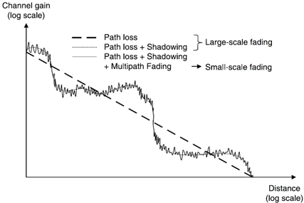
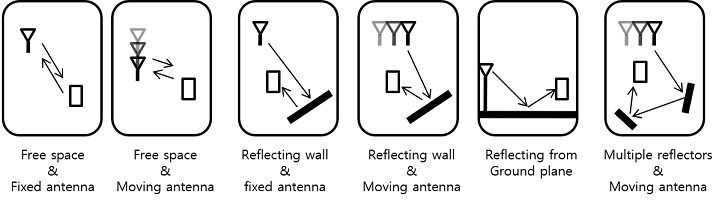
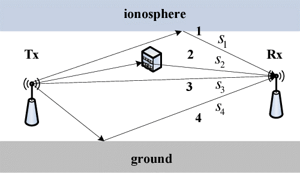

# Fundamentals_of_Wireless_Communication
Cambridge 출간 David Tse 지음
무선통신을 혼자 독학하고 정기 세미나를 통해 내용을 복습해보겠다!
책은 너무 비싸니 pdf로 보자 하하하

#### 목표
책의 주요 단원을 읽고 나름대로 정리해볼 것이며 정기 세미나 ppt는 업로드할 예정이다.

##### 1. The Wireless Channel (2021.03.31)
무선 채널이 뭘까?

무선채널을 이해하기 좋은 방법(Key)로는 
1. 물리적인 파라미터
2. 모델링 문제
등.. 이있다.

무선 채널의 특징은 **시간 (time)**,  **주파수 (frequency)** 에따른 채널 강도 (the channel strength)의 변형 (variations)을 의미한다.
대략적으로 2개의 type이 있다.

1. Large-scale fading : 거리 또는 shadowing (장애물)의 영향으로 생기는 신호의 경로 감쇄를 뜻한다. 셀 크기를 벗어날만한 큰 이동에서 발생한다.
그림에서 거리에 따라 채널 이득이 완만하게 떨어지는 기울이가 완만한 그래프이다.
--> cell-site planning 셀 사이즈에서 주로 관련있는 모델이다.

2. Small-scale fading : 송 수신기 사이의 다중 (신호)경로로 인한 파괴적인 간섭으로 공간적 스케일이 작은 곳에서 주로 발생한다.
그림에서 거리에 따른 채널이득이 자잘하게 변화하는 그래프이다.
--> 통신 시스템을 안정적이고 효율적으로 디자인 하기위해서 이 모델을 더 탐구할 필요가 있다.

무선 채널을 가장 명확하고 정확하게 파악하기 위해서는 송신기와 수신기 사이 물리적 현상을 방정식으로 공식화하면 된다.
하지만, 무선 통신은 수많은 path (경로), 반사 (reflected), 회절 (scattered)등 여러 변수가 있기에 완벽한 물리적 파라미터 정의가 불가능 하다.
그래서 정확한 물리적 파라미터는 이상적인 전송 시나리오에서 정의 가능하다. (신호는 전자기장이기 때문에 ㅎㅎ)

다음과 같은 시나리오가 있다. 이러한 물리적 모델을 잘 이해한다면 무선채널을 모델링 할때 충분히 도움이 될 것이다.
그럼 이제 실제 무선채널을 설명할 수 있을 모델링 문제로 넘어가 보자!

###### 1.1 Input/output model of the wireless channel
무선 채널을 모델링 하기 위해서 무선 채널의 입력과 출력을 알아야 할 필요가 있다.

###### 1.1.1 The wireless channel as a linear time-varing system

다중 경로 (multi-path)의 영향은 선형 시변 시스템 (linear time-varing system)으로 모델링 할 수 있다.
일반적으로 신호의 입력 응답은 정현파로 나타낸다.

신호는 path i에 따라 감쇄와 지연이 발생하여 송신단에게 전송된다. 감쇄 :  와 지연 : 이라면 송신단은 다음과 같은 신호를 받을 것이다.

